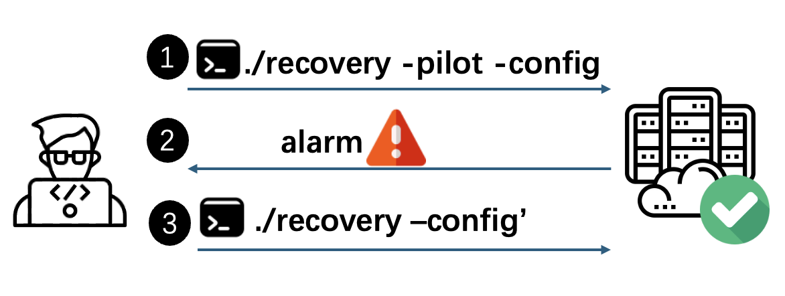

# Source Code Repository for the PILOT Project

This repo contains the research artifact (demo) for our paper *"Pilot Execution: Simulating Failure Recovery In Situ for Production Distributed Systems"* — NSDI'26.

PILOT is a tool that enables operators to safely "dry-run" recovery actions on a live production system before committing to them. It instruments the target system's bytecode to support *pilot execution*—an isolated trial of a recovery procedure that runs alongside the real system.

If the pilot run succeeds, the operator proceeds with the real recovery. If it fails, PILOT provides detailed feedback (error information and a context tree) so the operator can diagnose the issue, adjust the recovery strategy, then commit to production.



---

## Table of Contents

- [Overview](#overview)
- [Repository Structure](#repository-structure)
- [Requirements](#requirements)
- [Getting Started](#getting-started)
    - [0. Set Up CloudLab Machines (Recommended)](#0-set-up-cloudlab-machines-recommended)
    - [1. Set Up Environment](#1-set-up-environment)
    - [2. Build PILOT Instrumentation Engine](#2-build-pilot-instrumentation-engine)
    - [3. Build PILOT Runtime Library](#3-build-pilot-runtime-library)
    - [4. Deploy ZooKeeper](#4-deploy-zookeeper)
- [End-to-End Example: Detecting SOLR-17515](#end-to-end-example-detecting-solr-17515)
    - [Step 1. Build Solr](#step-1-build-solr)
    - [Step 2. Instrument Solr](#step-2-instrument-solr)
    - [Step 3. Reproduce on Buggy Version](#step-3-reproduce-on-buggy-version)
    - [Step 4. Reproduce on Fixed Version](#step-4-reproduce-on-fixed-version)

---

## Overview

PILOT works in two phases:

1. **Offline (Instrumentation):** A static bytecode transformer instruments the target system to support pilot execution.
2. **Online (Pilot Run):** The operator triggers pilot execution of their intended recovery. PILOT reports success or failure and produces a context tree for debugging.

## Repository Structure

| Component                    | Description                                                     | Path                   |
| ---------------------------- | --------------------------------------------------------------- | ---------------------- |
| PILOT Instrumentation Engine | Transforms bytecode of target systems to enable pilot execution | `PilotExecution/src`   |
| PILOT Runtime Library        | Manages pilot execution at runtime                              | `PilotExecution/Pilot` |

---

## Requirements

- **OS:** Ubuntu 20.04 / 22.04
- **JDK:** OpenJDK 8
- **Git:** >= 2.16.2
- **Apache Maven:** >= 3.6.3
- **Apache Ant:** >= 1.10.9

> [!TIP]
> We **highly recommend** using our [CloudLab profile](#0-set-up-cloudlab-machines-recommended), which provisions a ready-to-use three-node cluster with all dependencies pre-installed.

---

## Getting Started

### 0. Set Up CloudLab Machines (Recommended)

We provide a CloudLab profile that automatically starts a three-node cluster (`node0`, `node1`, `node2`) with all dependencies pre-configured.

1. Instantiate the profile via this link: **[PILOT-cloudlab](https://www.cloudlab.us/p/SilentFailure/PILOT-cloudlab)**. Keep hitting **Next** to create the experiment.
2. Access the machines via SSH from the CloudLab Web UI.

### 1. Set Up Environment

On **all nodes** (`node0`, `node1`, `node2`):

```bash
export JAVA_HOME=/usr/lib/jvm/java-8-openjdk-amd64
echo 'export JAVA_HOME=/usr/lib/jvm/java-8-openjdk-amd64' >> ~/.bashrc

export PATH="/usr/lib/jvm/java-8-openjdk-amd64/bin:$PATH"
echo 'export PATH="/usr/lib/jvm/java-8-openjdk-amd64/bin:$PATH"' >> ~/.bashrc
```

Verify:

```bash
echo $JAVA_HOME
# Expected: /usr/lib/jvm/java-8-openjdk-amd64
```

> [!IMPORTANT]
> All remaining steps are performed on **`node0` only**, unless otherwise noted.

### 2. Build PILOT Instrumentation Engine

```bash
cd ~ && git clone -b main --recurse-submodules https://github.com/LiftLab-UVA/PilotExecution
cd ~/PilotExecution
chmod +x clone_build.sh
./clone_build.sh instrumentationengine
```

You should see `All tasks completed` on success.

### 3. Build PILOT Runtime Library

```bash
./clone_build.sh runtimelib
```

You should see `BUILD SUCCESS` on success.

### 4. Deploy ZooKeeper

PILOT uses a ZooKeeper cluster as a status registry during pilot runs.

```bash
cd ~/PilotExecution/experiments/zookeeper_setup/
./setupzookeeper.sh
```

You should see `ZooKeeper Cluster Deployment Completed` on success.

---

## End-to-End Example: Detecting SOLR-17515

This walkthrough demonstrates PILOT's full workflow using [SOLR-17515](https://issues.apache.org/jira/browse/SOLR-17515), a real-world recovery bug in Apache Solr.

**Scenario:** One node in a Solr cluster fails. The operator attempts recovery by having the failed node sync with an alive node and rejoin the cluster. On the buggy version, this recovery fails with NPE due to an incorrect configuration.

> [!IMPORTANT]
> Complete all [Getting Started](#getting-started) steps before proceeding. All commands run on **`node0`**.

### Step 1. Build Solr

Compiles Solr from source and integrates the PILOT runtime library:

```bash
cd ~/PilotExecution/experiments/solr17515/managesolr
./build_solr.sh
```

You should see `Build and Deploy Completed`.

### Step 2. Instrument Solr

Instruments Solr's bytecode and repackages it with pilot execution enabled:

```bash
cd ~/PilotExecution/experiments/solr17515
./generate_original.sh && ./instrument_pilot.sh
```

You should see `Update task completed`.

### Step 3. Reproduce on Buggy Version

#### 3a. Inject the Bug

```bash
cd ~/PilotExecution/experiments/solr17515
./reproduce.sh bug
```

#### 3b. Trigger Pilot Execution

```bash
./execute_recovery.sh pilot
```

Because the code is buggy, pilot execution **detects the failure** and reports an error along with a context tree for debugging:

```
========================================
     PILOT execution results
========================================

Error detected
... java.lang.NullPointerException ...

========================================
context tree is
========================================

[pilotexecution] ROOT (tid=0, ts=0)
├── [node1] getCore$instrumentation (tid=64, ts=...)
│   └── ...
├── [node1] doRecovery$instrumentation (tid=64, ts=...)
│   └── [node1] run$instrumentation (tid=65, ts=...)
│       └── ...
```

Each node in the context tree shows: `([hostname] functionname (threadId, Timestamp))`.

#### 3c. Apply a Minor Tweak

The root cause of SOLR-17515 is an incorrect configuration. As described in the issue, SolrCloud users can prevent this NPE by ensuring the `solr.httpclient.builder.factory` system property is not set on their Solr nodes (this system property is set by the `bin/solr` startup script itself if `SOLR_AUTH_TYPE` is specified in `solr.in.sh`, so removing the `SOLR_AUTH_TYPE` env-var will also help). The operator can fix it with this minor tweak:

> **Note:** For simplicity, we manually inject the error for reproduction. Here, to simulate the tweak, we simply remove the fault marker.

```bash
./tweak_conf.sh
```

#### 3d. Verify with Normal Recovery

```bash
./execute_recovery.sh normal
```

Expected output: `Finished recovery process, successful=[true]`

### Step 4. Reproduce on Fixed Version

After the bug was reported, the Solr developers pushed a fix. On the fixed version, pilot execution succeeds without any tweaks.

#### 4a. Apply the Fix

```bash
cd ~/PilotExecution/experiments/solr17515
./reproduce.sh fix
```

#### 4b. Trigger Pilot Execution

```bash
./execute_recovery.sh pilot
```

This time pilot execution **succeeds**:

```
========================================
     PILOT execution results
========================================

Recovery successful:
... Finished recovery process, successful=[true]
```

#### 4c. Verify I/O Isolation

To confirm that the pilot run was fully isolated, inspect the shadow directory:

```bash
cd ~/PilotExecution/experiments
./print_shadow_file.sh
```

All pilot I/O is redirected under `/opt/ShadowDirectory`:

```
/opt/ShadowDirectory
└── opt
    └── SolrData
        ├── filestore
        ├── mycollection_shard1_replica_n1
        │   └── data
        │       └── index
        │           ├── _0.fdm
        │           ├── _0.fdt
        │           └── ...
```

#### 4d. Perform Normal Recovery

After a successful pilot run, the operator proceeds with the real recovery:

```bash
cd ~/PilotExecution/experiments/solr17515
./execute_recovery.sh normal
```

Expected output: `Finished recovery process, successful=[true]`